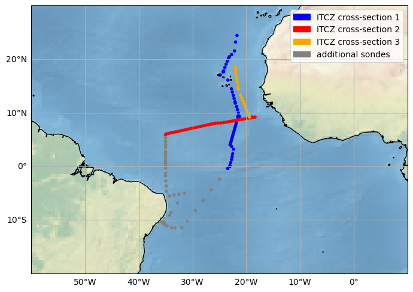

# Radiosoundings of CircBrazil campaign
[](https://doi.org/110.5281/zenodo.7051674)

This repository contains references to the radiosoundings and their post-processing steps of the cruise
*Tropical Atlantic Circulation and Climate: Mooring Rescue* or short *CircBrazil*. This cruise undertaken on RV Sonne has the identifier SO284.

The cruise started June 27, 2021 in Emden, Germany and ended August 16, 2021 in Emden, Germany.

Further general information about the cruise can be found in the [cruise report](https://doi.org/10.48433/cr_so284)

## Dataset

### Overview about sounding positions


The [dataset](https://doi.org/110.5281/zenodo.7051674) contains three processing levels:

|Processing level | Description | Usage examples |
| --- | --- | --- |
| 0 | mwx sounding files as delivered by Vaisalas sounding software | Checking specific setup of sounding station, Archival of data |
| 1 | Level 0 data converted to netCDF4 | Analysis of single soundings for the most accurate measurements possible |
| 2 | Level 1 data interpolated to a vertical grid | Analysis of entire campaign or comparison with other observations or simulations |

## Reprocessing
By running `reproduce.sh` the level 1 and level 2 data can be reproduced. Output units, variable names, and global attributes
can be setup with the yaml files in the `config` folder.

To release a new version of the dataset, please make sure to adjust the DOI in `config/level1.yaml` and `config/level2.yaml`.
DOI can be reserved before publishing at most DOI providers, e.g. at [zenodo.org](https://help.zenodo.org/) by creating a new record/version.

## Minimal example
### Level2 data overview

Note: the following example downloads the data directly from zenodo. It might therefore take some time to execute the first time.

```python
import xarray as xr
import fsspec
import numpy as np
import matplotlib.pyplot as plt

m = fsspec.open("zip://data/level2/CircBrazil_Sonne_soundings_level2_v1.0.0.nc::simplecache::https://zenodo.org/api/files/48e1380e-eb65-47fe-8642-c38430495efd/data.zip")

layout = {'dz': {'vmin':-10, 'vmax':10, 'cmap':'RdBu'}}
fig, axs = plt.subplots(4,4,figsize=(17,12),sharex=True, sharey=True)
with m as f:
    ds = xr.open_dataset(f)
    ds = ds.sortby("launch_time")
    vars_to_plot = [var for var in ds.data_vars if ds[var].dims == ('sounding', 'alt')]
    for v, var in enumerate(ds[vars_to_plot].data_vars):
        args=layout.get(var, {})
        ds.assign_coords({'sounding': np.arange(ds.dims['sounding'])})[var].plot(x='sounding', **args, ax=axs.flatten()[v])
plt.tight_layout()
plt.savefig("Level2_Overview.png", bbox_inches="tight")
```

